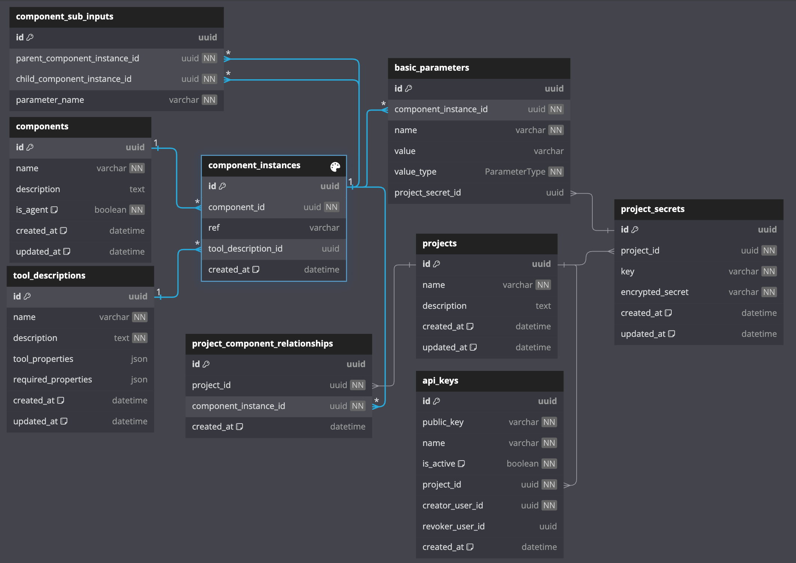
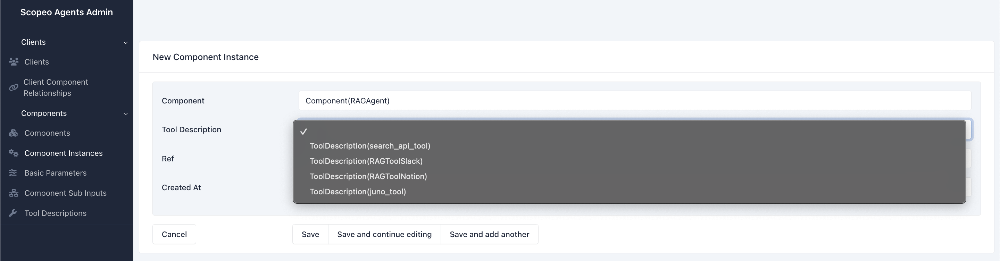
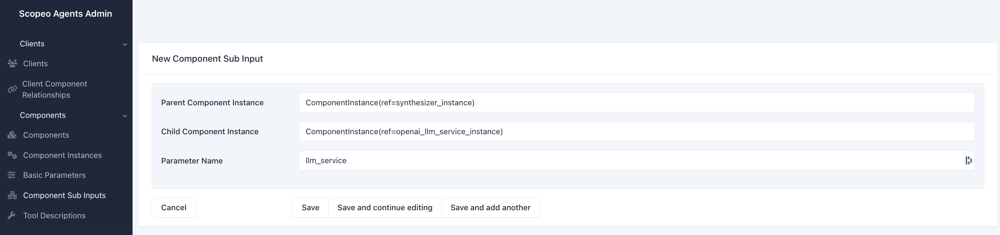

## Backend for Agent Management.

### **Overview**

`ada_backend` is a backend framework for managing client-parameterized AI agents, built on FastAPI. It leverages a clean `repository-service-controller` architecture, dynamic component instantiation, and an SQLAdmin interface for seamless configuration. The system is designed for modularity, scalability, and extensibility.

---

### **Commands**

| Command                                                       | Description                        |
| ------------------------------------------------------------- | ---------------------------------- |
| `make run-scopeo-agents-backend`                              | Runs the backend server.           |
| `poetry run python -m ada_backend.database.setup_db`          | Creates tables in the database.    |
| `poetry run python -m ada_backend.scripts.test_db_connection` | Tests database connection.         |
| `poetry run python -m pytest ada_backend`                     | Runs tests.                        |
| `poetry run python -m ada_backend.database.seed_db`           | Seeds the database with test data. |

---

### **Project Structure**

The project is organized into the following main modules:

1. **Database Layer** (`database/`):

   - **`models.py`**: Defines database schemas (clients, components, instances, etc.).
   - **`setup_db.py`**: Handles database initialization and session management.
   - **`seed_db.py`**: Seeds example components, agents, and their relationships for testing.

2. **Repositories** (`repositories/`):

   - Abstract database operations into reusable CRUD functions.
   - Examples: `client_repository.py`, `component_repository.py`.

3. **Services** (`services/`):

   - Encapsulate business logic.
   - Includes dynamic component instantiation (`agent_builder_service.py`), centralized component registration (`registry.py`), and agent running (`agent_runner.py`).

4. **Controllers** (`routers/`):

   - Define HTTP routes.

5. **Admin Interface** (`admin/`):

   - SQLAdmin-based UI for managing components, instances, and relationships.

6. **Entry Point** (`main.py`):
   - Initializes FastAPI app, admin interface, and sets up routing.

---

### **Schema**

The schema below shows the database structure, with tables for managing clients, components, and their instances and relationships:



**Table Descriptions**:

- **Components**: Defines reusable components like agents or services. (e.g., RAGAgent, EmbeddingService, CompletionService...).
- **ComponentInstances**: Parameterized instances of components. Represents a component that can be instantiated.
- **BasicParameters**: Key-value pairs of primitive parameters for `ComponentInstances`. (e.g., model_name: "gpt4-turbo").
- **ToolDescriptions**: Metadata for tools used by OpenAI function calls.
- **ComponentSubInputs**: Relationships between components instances. Represents a sub-input of a component. (e.g., A Syntherizer instance uses an CompletionService instance as a sub-input).
- **Projects**: Groups `ComponentInstances` together.
- **ProjectComponentRelationships**: Links `Projects` with `ComponentInstances`.
- **OrganizationSecrets**: Secrets key-value pairs for organization, such as API keys. These are stored encrypted in the database.
- **ApiKeys**: API keys for projects.

---

### **How It Works**

#### 1. **Architecture**:

- **Repository**: Handles database CRUD operations (e.g., fetch client data, add components).
- **Service**: Encapsulates logic for running agents or building components dynamically.
- **Controller**: Exposes services via RESTful APIs.

#### 2. **Dynamic Instantiation**:

- Components are dynamically instantiated using factories.
- New components are registered in the `registry.py`.
- The `registry.py` maps component types to their respective factories:

  ```python
  registry.register(
     # Corresponds to component.name in the database
     name=SupportedEntityType.SYNTHESIZER,
     # Factory for instantiating the component,
     # takes the Synthesizer class from agentic_tools
     factory=EntityFactory(entity_class=Synthesizer),
  )
  ```

- Most of the time, the base factory class suffices, but custom factories can be created for more complex components by subclassing `EntityFactory`.

#### 3. **Authentication**:

- **User Management**: Users are authenticated via **Supabase**.
- **API Key System**:

  - Authenticated users (via a Supabase JWT) can request their **API keys**, which are stored in the database. This is handled in `auth_router.py`.

- **API Key Characteristics**:
  - Each key is **associated with a project**.
  - Users can **revoke** their API key at any time.
  - The key allows users to **run agent inferences** for the associated project.
  - A record is maintained of **who created and revoked** the API key.
- **Key Generation & Authentication**:
  - A **key pair** (public and private) is generated using **RSA**.
  - The **public key** is stored in the database, while the **private key** is sent to the client.
  - To make a request, the client **includes the private key** in the request header.
  - The backend then **verifies the private key** using the corresponding **public key** from the database.
- **Other Authentication**:
  - The rest of the authentication is managed via **JWT tokens** handled by the backend.
  - ⚠️ **Note**: This JWT **is not the same** as the Supabase JWT.

---

#### 4. **Extending the Framework**

1. **Adding New Components**:

   - Add the new component to the `components` table.
   - Register its factory in `registry.py` using the `FACTORY_REGISTRY`.
   - Implement custom logic for instantiation in a new factory if needed.

2. **Creating New Instances**:

   - Recommended: Use the SQLAdmin interface.
   - Alternative: Update `seed_db.py` to create instances until a service for agent configuration is built.

3. **Testing**:
   - **Mocks**:
     - **Fake Mock Data**: Found in `tests/mocks/`. This is used to test simple CRUD operations and does not rely on seeded database data.
     - **"Real" Mock Data**: Uses a scoped session and seeds the database with real data via `seed_db.py`. This is useful for testing whether agents and components are instantiated correctly.
     - Note: The `seed_db.py` file may later be moved to `tests/mocks/` when a robust agent configuration service is implemented.

---

#### 5. **Admin Interface Preview**

The SQLAdmin interface provides a clean, user-friendly way to manage components, instances, and relationships (viewing, editing, deleting). Here's a preview of the interface:

##### **Overview**:

On the left-hand sidebar, we can navigate between key entities such as Clients, Components, and their relationships

For example, here we see the Component Instances table, showing the details of all registered components instances in the system. Here, we can see information like the component type (clickable reference to the Components table), ref, tool description (clickable reference to the Tool Descriptions table, when it exists), and creation date.


##### **Creating a new instance**:

We can create a new instance of a component by clicking on the "New Component Instance" button. This will open a form where we can specify its values.

The creation form offers dropdowns for selecting the component type and tool description (if needed). These entities are linked to their respective tables.



Then, we can create it's basic parameters, as well as any sub-inputs (if the component has any) in their respective tabs. For example, here we set an CompletionService instance as the input of a Syntherizer instance. In other words, we are stating that the Syntherizer has an CompletionService as a sub-input with name "completion_service".



##### **Customizing the interface**:

The SQLAdmin interface can be customized to include additional features, such as search, filtering, and pagination, etc.

The interface is already quite customized, with features like clickable references, but there is room for further enhancements. We can also add more actions and buttons to make the interface more interactive. The idea of the interface is to provide us with a quick and easy way to manage the database without having to code too much.

**Future enhancements could include:**

- Customize component creation form to call the component configuration service/endpoint (this would create all the related instances and relationships automatically).
- Add validators to the form fields to ensure data integrity.
- Etc.

### **Database Configuration**

This project can be run with SQLite and PostgreSQL. To choose the database, you need to set the correct values in `credentials.env`.

The approach is:

- **SQLite**: Only `ADA_DB_URL` is required
- **PostgreSQL**: Individual connection parameters are required (`ADA_DB_HOST`, `ADA_DB_USER`, etc.)

You can use the test script to verify your connection:

```
poetry run python -m ada_backend.scripts.test_db_connection
```

#### SQLite Configuration

For SQLite, you need to set the `ADA_DB_URL` value in your `credentials.env`:

```
ADA_DB_DRIVER=postgresql
ADA_DB_HOST=localhost
ADA_DB_PORT=5432
ADA_DB_USER=ada_user
ADA_DB_PASSWORD=ada_password
ADA_DB_NAME=ada_backend
```

If using PostgreSQL in local development, make sure PostgreSQL is running. You can run it with Docker:

```
# Start PostgreSQL only
docker-compose up -d postgres

# To start all services
docker-compose up -d

# To check the status of the services
docker-compose ps

# To view logs
docker-compose logs -f

# To stop the services
docker-compose down
```

Make sure your `credentials.env` file has the correct PostgreSQL settings before starting the containers.

---
