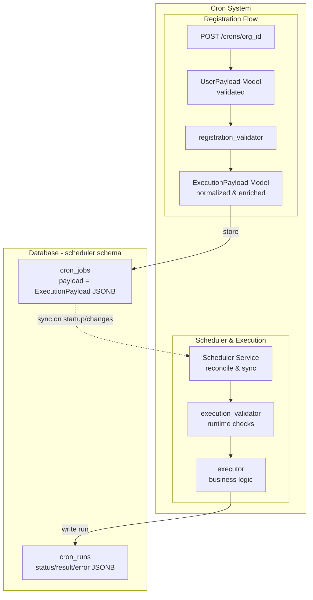

# 🕰️ CRON System Overview

The CRON system automates scheduled tasks using APScheduler with our database as the single source of truth. It provides a registry-based approach for different job types with proper validation at each stage.

## Key Components

**Database Schema (scheduler)**

- `cron_jobs` - Job definitions: cron expression, timezone, entrypoint, payload (JSONB), active status
- `cron_runs` - Execution history: status, result, error, timestamps
- `apscheduler_jobs` - APScheduler's internal state (managed by APScheduler)

**API Layer**

- Simple CRUD endpoints for registering/managing cron jobs
- Service layer handles validation and coordinates between our tables and scheduler service

**Scheduler Service**

- Runs outside the service layer with APScheduler logic
- Added to backend via FastAPI lifespan
- Syncs with cron_jobs table as ground truth on startup and changes

## System Flow



## Registry System

The registry defines the lifecycle for each cron job "type" or entrypoint. Each entry specifies:

- **User Payload Schema** - What data the user provides when registering
- **Registration Validator** - Validates input and returns execution payload
- **Execution Payload Schema** - Normalized data stored in cron_jobs.payload
- **Execution Validator** - Runtime validation before execution
- **Executor** - The actual business logic that runs

This ensures clean separation between user input and internal execution data.

## Current Entrypoints

**dummy_print** (for testing)

- User payload: `{ message: string, error_rate?: 0-1 }`
- Registration: validates message, stores user/org IDs
- Execution: prints message, can simulate random failures

**agent_inference**

- User payload: `{ project_id: UUID, env: "draft"|"production", input_data: dict }`
- Registration: validates project exists and belongs to organization
- Execution: calls run_env_agent, stores results with message/artifacts

## How to add a new cron entrypoint (type)

1. Add entrypoint enum

- Add a value to `CronEntrypoint` in `ada_backend/database/models.py` (requires a DB migration to extend the Postgres enum).

2. Create an entry module

- Create `ada_backend/services/cron/entries/<your_name>.py` with:
  - `YourUserPayload(BaseUserPayload)` – incoming API shape for registration
  - `YourExecutionPayload(BaseExecutionPayload)` – normalized payload persisted in `cron_jobs.payload`
  - `validate_registration(user_input, **kwargs) -> YourExecutionPayload`
  - `validate_execution(execution_payload, **kwargs) -> None`
  - `async def execute(execution_payload, **kwargs) -> dict`
  - `spec = CronEntrySpec(...)`

```python
from ada_backend.services.cron.core import BaseUserPayload, BaseExecutionPayload, CronEntrySpec

class MyUserPayload(BaseUserPayload):
    ...

class MyExecutionPayload(BaseExecutionPayload):
    ...

def validate_registration(user_input: MyUserPayload, **kwargs) -> MyExecutionPayload:
    return MyExecutionPayload(...)

def validate_execution(execution_payload: MyExecutionPayload, **kwargs) -> None:
    pass

async def execute(execution_payload: MyExecutionPayload, **kwargs) -> dict[str, object]:
    return {"ok": True}

spec = CronEntrySpec(
    user_payload_model=MyUserPayload,
    execution_payload_model=MyExecutionPayload,
    registration_validator=validate_registration,
    execution_validator=validate_execution,
    executor=execute,
)
```

3. Register in the registry

- Map the enum to your `spec` in `ada_backend/services/cron/registry.py`:
  - `CRON_REGISTRY[CronEntrypoint.MY_ENTRY] = spec`

4. Use via API

- `POST /crons/{organization_id}` with body:

```json
{
  "name": "my job",
  "cron_expr": "0 9 * * 1-5",
  "tz": "UTC",
  "entrypoint": "my_entry",
  "payload": {
    /* matches YourUserPayload */
  }
}
```

**NOTE:** The protocols can be found at `ada_backend/services/cron/core.py` and serve as an implementation guide. They may evolve in the future. The next step is to define stricter function signatures to keep the system robust.
